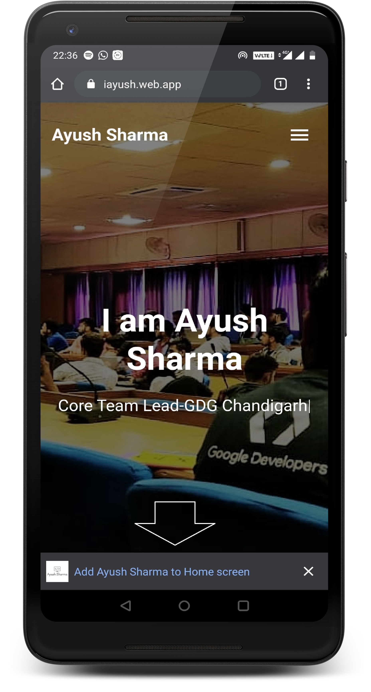
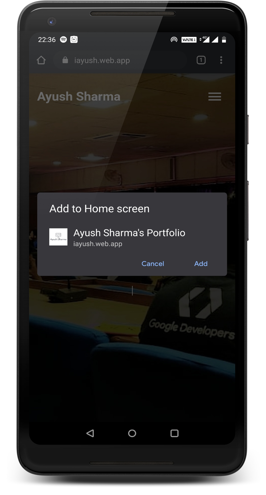
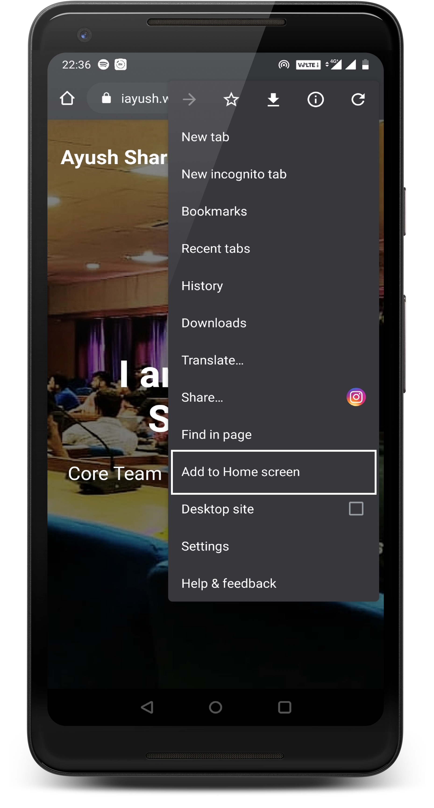
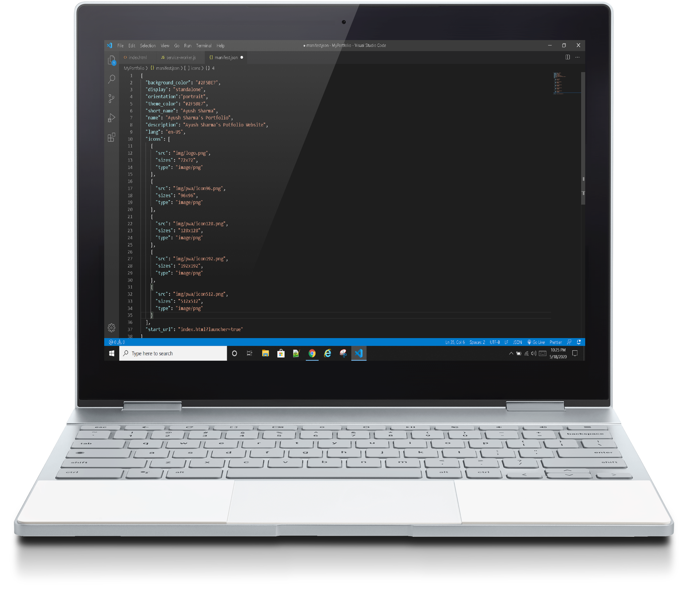
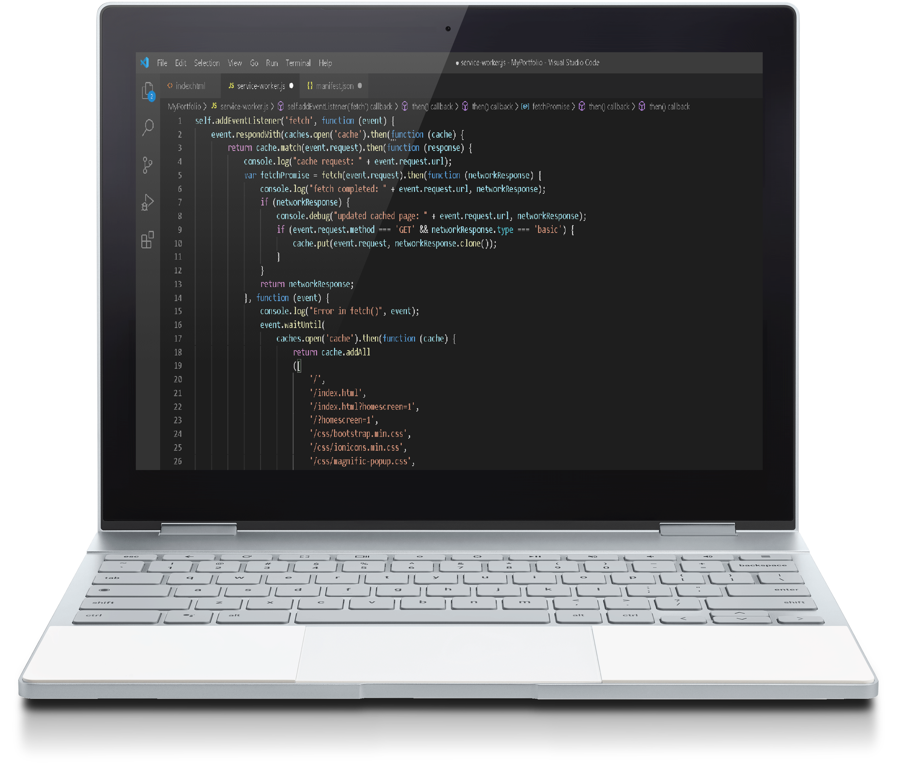
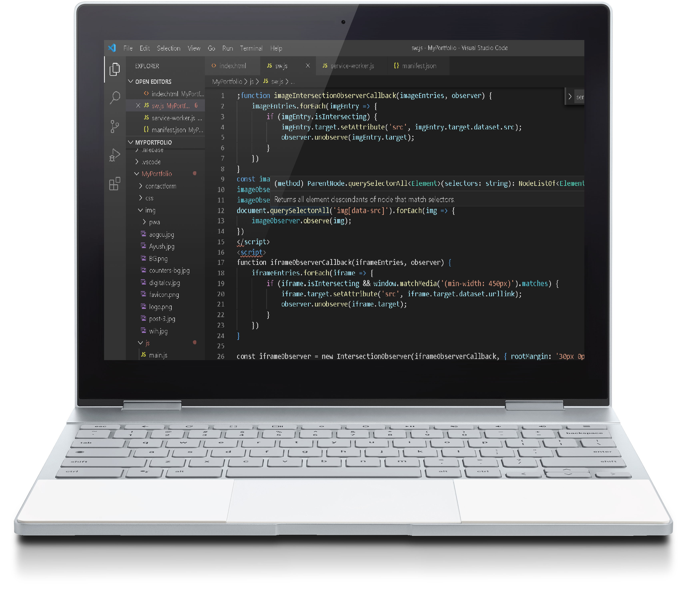

# PWA - PROGRESSIVE WEB APPLICATION
   

I am using my Portfolio Website for the DEMO. You can Use any responsive website for the same.

| Name | DEMO |  
| PWA |[Ayush's Portfolio](https://iayush.web.app) |  
| PWA |[Nilay Das's Portfolio](https://inilaydas.web.app) |  
| PWA |[Rahul Singh's Portfolio](https://irahulsingh.web.app) | 
| PWA |[Fauji Travel Agency ](https://faujitravelhp.web.app) |  
| PWA |[Fauji Travel Agency ](https://faujitravelhp.firebaseapp.com) |

### STEPS
- Create an app manifest
- Add it to your base HTML template
- Create the service worker
- Serve the service worker on the root of the scope you used in the manifest
- Add a 

And then deploy these changes –  you should see your service worker posting logs in your browser’s console. If you are testing this from a phone, see platform-specific instructions here for iOS+Safari and here for Chrome+Android.

### Deploy Your Progressive Web App
Deploying your web app is going to be specific to how your app is developed. On firebase or on any server.

### Resources

| Name | Link |
| --- | --- |
| PWA |[Google Developers](https://developers.google.com/web/updates/2015/12/getting-started-pwa) |
| PWA |[Code Lab](https://codelabs.developers.google.com/codelabs/your-first-pwapp) |

### MIT License

Copyright (c) 2020 Ayush Sharma

Permission is hereby granted, free of charge, to any person obtaining a copy
of this software and associated documentation files (the "Software"), to deal
in the Software without restriction, including without limitation the rights
to use, copy, modify, merge, publish, distribute, sublicense, and/or sell
copies of the Software, and to permit persons to whom the Software is
furnished to do so, subject to the following conditions:

The above copyright notice and this permission notice shall be included in all
copies or substantial portions of the Software.

THE SOFTWARE IS PROVIDED "AS IS", WITHOUT WARRANTY OF ANY KIND, EXPRESS OR
IMPLIED, INCLUDING BUT NOT LIMITED TO THE WARRANTIES OF MERCHANTABILITY,
FITNESS FOR A PARTICULAR PURPOSE AND NONINFRINGEMENT. IN NO EVENT SHALL THE
AUTHORS OR COPYRIGHT HOLDERS BE LIABLE FOR ANY CLAIM, DAMAGES OR OTHER
LIABILITY, WHETHER IN AN ACTION OF CONTRACT, TORT OR OTHERWISE, ARISING FROM,
OUT OF OR IN CONNECTION WITH THE SOFTWARE OR THE USE OR OTHER DEALINGS IN THE
SOFTWARE.

